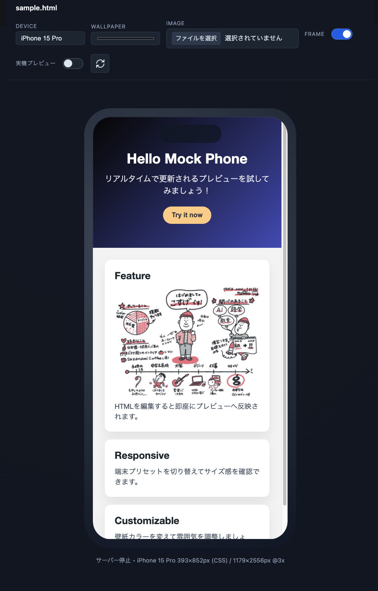

# Mock Phone Preview - Mobile Device Preview for VS Code

Live mobile phone preview for HTML/CSS inside VS Code. View your web pages inside realistic mobile device frames with real-time updates and test on actual mobile devices using QR codes.

## ✨ Features

### 🎨 Real-time Preview
- **Instant Updates**: Automatically refreshes as you edit HTML/CSS files
- **Image Support**: Displays images from relative paths (supports `` tags and CSS `background-image`)
- **CSS Inline Processing**: Automatically inlines external stylesheets for accurate rendering

### 📱 Realistic Device Frames
Choose from the latest flagship devices:
- iPhone 15 Pro / Pro Max
- Galaxy S24 Ultra
- Pixel 9 Pro

### 📲 QR Code Preview (NEW!)
Test your pages on real mobile devices:
- **Toggle "External Preview"** to generate a QR code
- **Scan with your phone** to view on actual device
- **Live reload** - changes sync automatically to your phone
- ※ Requires PC and phone on the same Wi-Fi network

### 🎨 Customization
- **Wallpaper Color**: Set background color with color picker
- **Wallpaper Image**: Upload custom background images
- **Frame Toggle**: Show/hide device bezels and notches
- **Device Rotation**: Portrait/Landscape orientation support

### 🌍 Multi-language Support
- English (default)
- Japanese (日本語)

### 💾 Session Persistence
Remembers your device selection and wallpaper settings across sessions.

## 📸 Screenshots



*Live preview with device frames, customizable wallpaper, and QR code for mobile testing*

## 🚀 Usage

### Quick Start (Recommended)
1. Right-click on any HTML file in the Explorer or Editor
2. Select **"Preview in Phone Frame"** (or **"スマホフレームでプレビュー"** in Japanese)
3. Edit your HTML/CSS and see changes in real-time

### Alternative Method
1. Open an HTML file in VS Code
2. Open Command Palette (`Cmd+Shift+P` / `Ctrl+Shift+P`)
3. Run **"Preview in Phone Frame"**

### Using QR Code Preview
1. Start preview as described above
2. Toggle **"External Preview"** (実機プレビュー) switch in the toolbar
3. A QR code will appear on the screen
4. Scan it with your phone's camera
5. Your page opens on your phone and updates automatically when you save changes

## 🎮 Controls

| Control | Description |
|---------|-------------|
| **Device** | Select device model (iPhone, Galaxy, Pixel) |
| **Wallpaper** | Choose background color with color picker |
| **Image** | Upload custom wallpaper image |
| **Frame** | Toggle device bezels and notches on/off |
| **External Preview** | Enable QR code for mobile device testing |
| **Rotate** | Switch between portrait and landscape |

## 📋 Requirements

- VS Code 1.86.0 or higher
- HTML file saved to disk (untitled files not supported)

## 📥 Installation

### From VSIX
1. Download the `.vsix` file
2. Open VS Code
3. Go to Extensions view (`Cmd+Shift+X` / `Ctrl+Shift+X`)
4. Click `...` menu → `Install from VSIX...`
5. Select the downloaded file

### From Marketplace
Search for "Mock Phone Preview" in the VS Code Extensions marketplace and click Install.

### From Source
```bash
npm install
npm run compile
```
Press `F5` to run in Extension Development Host

## 🎯 Use Cases

- **Mobile-first Development**: Build and test responsive designs
- **Client Presentations**: Show mobile previews during meetings
- **Cross-device Testing**: Quickly test on multiple device sizes
- **Real Device Testing**: Use QR code to test on actual smartphones
- **Image-rich Pages**: Preview pages with images and backgrounds accurately

## ⚠️ Known Limitations

- Screenshot feature removed (use OS screenshot tools instead)
- CSS `url()` paths must be relative to HTML file location
- Live Share collaborative preview not yet implemented
- External preview requires PC and phone on same Wi-Fi network

## 🔒 Privacy & Security

- All processing happens locally on your machine
- External preview server only accessible on your local network
- No data is sent to external servers

## 🤝 Contributing

Contributions welcome! Please open an issue or pull request on GitHub.

## 📄 License

MIT License - see LICENSE file for details

## 👤 Author

Created by **Tatsuya Kosuge**

## 🙏 Credits

Device specifications based on:
- Apple Developer Human Interface Guidelines
- Android device size reference (genz.jp)

## 📝 Changelog

### Version 1.0.0
- ✨ Initial release with device frame preview
- 📲 QR code preview for real device testing
- 🖼️ Image path conversion support
- 🌍 Multi-language support (EN/JA)
- ⚡ Optimized bundle size (39KB)
- 🔄 Live reload functionality
- 🎨 Customizable wallpapers and frames

---

**Enjoy building beautiful mobile experiences! 📱✨**
